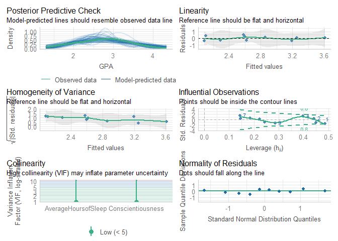
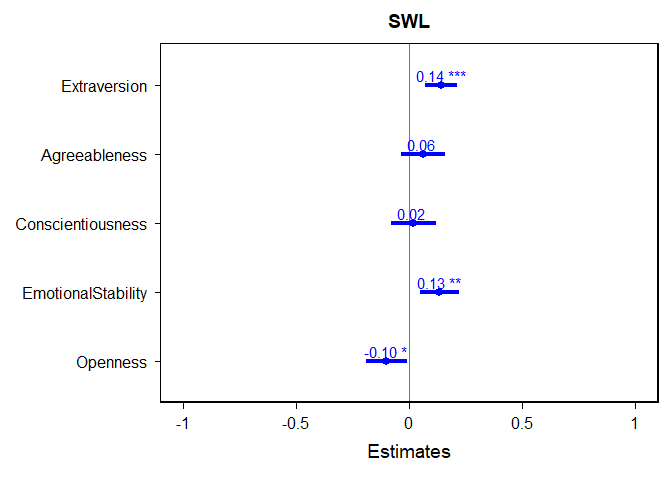

Lab7
================
Sidney Spilfogel
2024-10-17

# Load packages and dataset

``` r
library(haven)
library(bruceR)
```

    ## 
    ## bruceR (v2024.6)
    ## Broadly Useful Convenient and Efficient R functions
    ## 
    ## Packages also loaded:
    ## ✔ data.table ✔ emmeans
    ## ✔ dplyr      ✔ lmerTest
    ## ✔ tidyr      ✔ effectsize
    ## ✔ stringr    ✔ performance
    ## ✔ ggplot2    ✔ interactions
    ## 
    ## Main functions of `bruceR`:
    ## cc()             Describe()  TTEST()
    ## add()            Freq()      MANOVA()
    ## .mean()          Corr()      EMMEANS()
    ## set.wd()         Alpha()     PROCESS()
    ## import()         EFA()       model_summary()
    ## print_table()    CFA()       lavaan_summary()
    ## 
    ## For full functionality, please install all dependencies:
    ## install.packages("bruceR", dep=TRUE)
    ## 
    ## Online documentation:
    ## https://psychbruce.github.io/bruceR
    ## 
    ## To use this package in publications, please cite:
    ## Bao, H.-W.-S. (2024). bruceR: Broadly useful convenient and efficient R functions (Version 2024.6) [Computer software]. https://CRAN.R-project.org/package=bruceR

    ## 
    ## These packages are dependencies of `bruceR` but not installed:
    ## - pacman, openxlsx, ggtext, vars, phia, MuMIn, GGally
    ## 
    ## ***** Install all dependencies *****
    ## install.packages("bruceR", dep=TRUE)

``` r
library(dplyr)
library(ggstatsplot)
```

    ## You can cite this package as:
    ##      Patil, I. (2021). Visualizations with statistical details: The 'ggstatsplot' approach.
    ##      Journal of Open Source Software, 6(61), 3167, doi:10.21105/joss.03167

``` r
library(performance)
library(sjPlot)

ex <- read_sav("C:/Users/sidne/OneDrive/Documents/GitHub/Lab7/ex.sav")

lab7<-read.csv("C:/Users/sidne/OneDrive/Documents/GitHub/Lab7/lab7.csv")
```

# Correlation

``` r
#First, you will need to select variables or composites of interest

ex <- ex %>%
  select(Conscientiousness, AverageHoursofSleep, GPA) #don't need partiicpant ID so don't select it 

#The Corr function also gives you a correlation plot between all variables, but it doesn't look pretty enough and not very customizable

Corr(ex) #runs correlation
```

    ## Pearson's r and 95% confidence intervals:
    ## ───────────────────────────────────────────────────────────────────────
    ##                                            r      [95% CI]     p      N
    ## ───────────────────────────────────────────────────────────────────────
    ## Conscientiousness-AverageHoursofSleep   0.10 [-0.56, 0.69]  .775     10
    ## Conscientiousness-GPA                   0.83 [ 0.42, 0.96]  .003 **  10
    ## AverageHoursofSleep-GPA                -0.03 [-0.65, 0.61]  .939     10
    ## ───────────────────────────────────────────────────────────────────────

<!-- -->

    ## Correlation matrix is displayed in the RStudio `Plots` Pane.

``` r
#If you hate the correlation plot design, you can use the following function
ggcorrmat(ex)
```

<!-- -->

``` r
#If you want to visualize the correlation between two specifcic variables, you can use the following code
ggplot(ex, aes(x = Conscientiousness, y = GPA)) + geom_point() + geom_smooth() + theme_bruce()
```

    ## `geom_smooth()` using method = 'loess' and formula = 'y ~ x'

    ## Warning in simpleLoess(y, x, w, span, degree = degree, parametric = parametric,
    ## : pseudoinverse used at 2.98

    ## Warning in simpleLoess(y, x, w, span, degree = degree, parametric = parametric,
    ## : neighborhood radius 2.02

    ## Warning in simpleLoess(y, x, w, span, degree = degree, parametric = parametric,
    ## : reciprocal condition number 3.4517e-17

    ## Warning in simpleLoess(y, x, w, span, degree = degree, parametric = parametric,
    ## : There are other near singularities as well. 1

    ## Warning in predLoess(object$y, object$x, newx = if (is.null(newdata)) object$x
    ## else if (is.data.frame(newdata))
    ## as.matrix(model.frame(delete.response(terms(object)), : pseudoinverse used at
    ## 2.98

    ## Warning in predLoess(object$y, object$x, newx = if (is.null(newdata)) object$x
    ## else if (is.data.frame(newdata))
    ## as.matrix(model.frame(delete.response(terms(object)), : neighborhood radius
    ## 2.02

    ## Warning in predLoess(object$y, object$x, newx = if (is.null(newdata)) object$x
    ## else if (is.data.frame(newdata))
    ## as.matrix(model.frame(delete.response(terms(object)), : reciprocal condition
    ## number 3.4517e-17

    ## Warning in predLoess(object$y, object$x, newx = if (is.null(newdata)) object$x
    ## else if (is.data.frame(newdata))
    ## as.matrix(model.frame(delete.response(terms(object)), : There are other near
    ## singularities as well. 1

<!-- -->

``` r
#Note that the line will naturally follow the data points, but you can specify to plot the fittest line by adding method = lm to the geom_smooth() function
ggplot(ex, aes(x = Conscientiousness, y = GPA)) + geom_point() + geom_smooth(method = lm) + theme_bruce()
```

    ## `geom_smooth()` using formula = 'y ~ x'

<!-- -->

# Regression

``` r
#step 1: build a model
model<-lm(GPA ~ Conscientiousness + AverageHoursofSleep, data = ex) #lm = linear model (GPA predicting) ~ predicted by consci and sleep


#step 2: check the assumptions
check_model(model) #have to build model 1st before you can check the assumptions
```

<!-- -->

``` r
#step 3: summarize results; add ,std = TRUE if you want to get standardized coefficients
model_summary(model)
```

    ## 
    ## Model Summary
    ## 
    ## ──────────────────────────────
    ##                      (1) GPA  
    ## ──────────────────────────────
    ## (Intercept)           1.431   
    ##                      (0.667)  
    ## Conscientiousness     0.356 **
    ##                      (0.088)  
    ## AverageHoursofSleep  -0.039   
    ##                      (0.071)  
    ## ──────────────────────────────
    ## R^2                   0.702   
    ## Adj. R^2              0.617   
    ## Num. obs.            10       
    ## ──────────────────────────────
    ## Note. * p < .05, ** p < .01, *** p < .001.
    ## 
    ## # Check for Multicollinearity
    ## 
    ## Low Correlation
    ## 
    ##                 Term  VIF       VIF 95% CI Increased SE Tolerance
    ##    Conscientiousness 1.01 [1.00, 2.49e+11]         1.01      0.99
    ##  AverageHoursofSleep 1.01 [1.00, 2.49e+11]         1.01      0.99
    ##  Tolerance 95% CI
    ##      [0.00, 1.00]
    ##      [0.00, 1.00]

``` r
# or using the tab_model functionl; add  ,show.std = TRUE if you want to get standardized coefficients
tab_model(model)
```

<table style="border-collapse:collapse; border:none;">
<tr>
<th style="border-top: double; text-align:center; font-style:normal; font-weight:bold; padding:0.2cm;  text-align:left; ">
 
</th>
<th colspan="3" style="border-top: double; text-align:center; font-style:normal; font-weight:bold; padding:0.2cm; ">
GPA
</th>
</tr>
<tr>
<td style=" text-align:center; border-bottom:1px solid; font-style:italic; font-weight:normal;  text-align:left; ">
Predictors
</td>
<td style=" text-align:center; border-bottom:1px solid; font-style:italic; font-weight:normal;  ">
Estimates
</td>
<td style=" text-align:center; border-bottom:1px solid; font-style:italic; font-weight:normal;  ">
CI
</td>
<td style=" text-align:center; border-bottom:1px solid; font-style:italic; font-weight:normal;  ">
p
</td>
</tr>
<tr>
<td style=" padding:0.2cm; text-align:left; vertical-align:top; text-align:left; ">
(Intercept)
</td>
<td style=" padding:0.2cm; text-align:left; vertical-align:top; text-align:center;  ">
1.43
</td>
<td style=" padding:0.2cm; text-align:left; vertical-align:top; text-align:center;  ">
-0.15 – 3.01
</td>
<td style=" padding:0.2cm; text-align:left; vertical-align:top; text-align:center;  ">
0.069
</td>
</tr>
<tr>
<td style=" padding:0.2cm; text-align:left; vertical-align:top; text-align:left; ">
Conscientiousness
</td>
<td style=" padding:0.2cm; text-align:left; vertical-align:top; text-align:center;  ">
0.36
</td>
<td style=" padding:0.2cm; text-align:left; vertical-align:top; text-align:center;  ">
0.15 – 0.56
</td>
<td style=" padding:0.2cm; text-align:left; vertical-align:top; text-align:center;  ">
<strong>0.005</strong>
</td>
</tr>
<tr>
<td style=" padding:0.2cm; text-align:left; vertical-align:top; text-align:left; ">
AverageHoursofSleep
</td>
<td style=" padding:0.2cm; text-align:left; vertical-align:top; text-align:center;  ">
-0.04
</td>
<td style=" padding:0.2cm; text-align:left; vertical-align:top; text-align:center;  ">
-0.21 – 0.13
</td>
<td style=" padding:0.2cm; text-align:left; vertical-align:top; text-align:center;  ">
0.596
</td>
</tr>
<tr>
<td style=" padding:0.2cm; text-align:left; vertical-align:top; text-align:left; padding-top:0.1cm; padding-bottom:0.1cm; border-top:1px solid;">
Observations
</td>
<td style=" padding:0.2cm; text-align:left; vertical-align:top; padding-top:0.1cm; padding-bottom:0.1cm; text-align:left; border-top:1px solid;" colspan="3">
10
</td>
</tr>
<tr>
<td style=" padding:0.2cm; text-align:left; vertical-align:top; text-align:left; padding-top:0.1cm; padding-bottom:0.1cm;">
R<sup>2</sup> / R<sup>2</sup> adjusted
</td>
<td style=" padding:0.2cm; text-align:left; vertical-align:top; padding-top:0.1cm; padding-bottom:0.1cm; text-align:left;" colspan="3">
0.702 / 0.617
</td>
</tr>
</table>

``` r
#step 4: plot the results; change type ="est" to type = "std" if you want to plot the standardized coefficients
plot_model(model,  type ="est",  show.values = TRUE, vline.color = "#1B191999", line.size = 1.5, dot.size = 2.5, colors = "blue") + theme_bruce() #shows un-standardized coefficients and CI
```

<!-- -->

# Q1: Use the Corr or the ggcorrmat function to plot the correlation between all variables. Which personality traits are correlated with satisfaction with life and which one is not?

``` r
ggcorrmat(lab7)
```

<!-- --> Extraversion,
agreeableness, conscietniousness, and emotional stability are all
significantly correlated with life satisfaction, this is shown by p
\<0.05. Openess is not significantly correlated with life satisfaction,
this is shown by p \>0.05.

# Q2: Run a multiple regression using the Big 5 personality traits to predict satisfaction with life and plot the results

``` r
#for this lab assignment you would assume assumptions are met, but for your own analysis, you will need to examine assumptions carefully
model<-lm(SWL ~ Extraversion + Agreeableness + Conscientiousness + EmotionalStability + Openness, data = lab7)

#check_model(model) - assuming assumptions are met

model_summary(model)
```

    ## 
    ## Model Summary
    ## 
    ## ───────────────────────────────
    ##                     (1) SWL    
    ## ───────────────────────────────
    ## (Intercept)           2.191 ***
    ##                      (0.308)   
    ## Extraversion          0.140 ***
    ##                      (0.036)   
    ## Agreeableness         0.062    
    ##                      (0.049)   
    ## Conscientiousness     0.019    
    ##                      (0.051)   
    ## EmotionalStability    0.134 ** 
    ##                      (0.043)   
    ## Openness             -0.101 *  
    ##                      (0.046)   
    ## ───────────────────────────────
    ## R^2                   0.138    
    ## Adj. R^2              0.123    
    ## Num. obs.           294        
    ## ───────────────────────────────
    ## Note. * p < .05, ** p < .01, *** p < .001.
    ## 
    ## # Check for Multicollinearity
    ## 
    ## Low Correlation
    ## 
    ##                Term  VIF   VIF 95% CI Increased SE Tolerance Tolerance 95% CI
    ##        Extraversion 1.26 [1.14, 1.50]         1.12      0.79     [0.67, 0.88]
    ##       Agreeableness 1.34 [1.20, 1.59]         1.16      0.75     [0.63, 0.83]
    ##   Conscientiousness 1.36 [1.21, 1.61]         1.16      0.74     [0.62, 0.83]
    ##  EmotionalStability 1.42 [1.26, 1.68]         1.19      0.70     [0.59, 0.79]
    ##            Openness 1.28 [1.15, 1.52]         1.13      0.78     [0.66, 0.87]

``` r
plot_model(model,  type ="est",  show.values = TRUE, vline.color = "#1B191999", line.size = 1.5, dot.size = 2.5, colors = "blue") + theme_bruce() 
```

<!-- -->

# Q3: Interpret the intercept, the meaning of each of the unstandardized coefficient (e.g., one unit increase in A is associated with x point increase in B), and the R2. Which personality trait(s) can explain unique variance in satisfaction with life when controlling for each other, and which ones cannot? If someone asks you for advice on how to improve life satisfaction, based on your results, which personality trait would you recommend them to change and why?

The intercept of 2.191 means that with a score of zero on all of the big
5 traits someone will likely have a satisfaction of life score of 2.191.

A one unit increase in extroversion is associated with a 0.140 unit
increase in satisfaction with life. A one unit increase in agreeableness
is associated with a 0.062 unit increase in satisfaction with life. A
one unit increase in conscientiousness is associated with a 0.019 unit
increase in satisfaction with life. A one unit increase in emotional
stability is associated with a 0.134 unit increase with satisfaction
with life. A one unit increase in openness is associated with a 0.101
unit decrease in satisfaction with life.

The R^2 tells us that 13.8% of variability in satisfaction with life is
explained by the model.

Extroversion, emotional stability, and openness can explain unique
variance in life satisfaction with controlling for the other personality
traits, this is shown by the p value being \< 0.05. Agreeableness and
conscientiousness cannot explain unique variance in life satisfaction,
this is shown by the p value being \> 0.05.

If someone asked how to improve on their life satisfaction I would would
encourage them to work on improving their extroversion. This would
likely improve their life satisfaction because extroversion because it
is the strongest predictor of life satisfaction.
